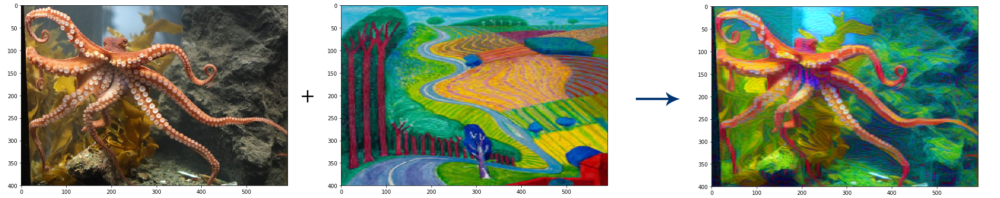
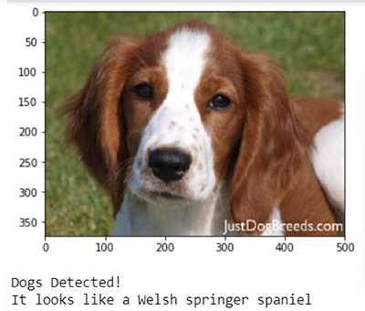
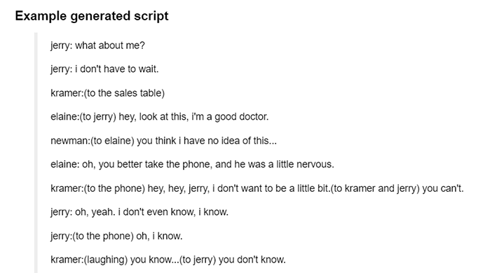
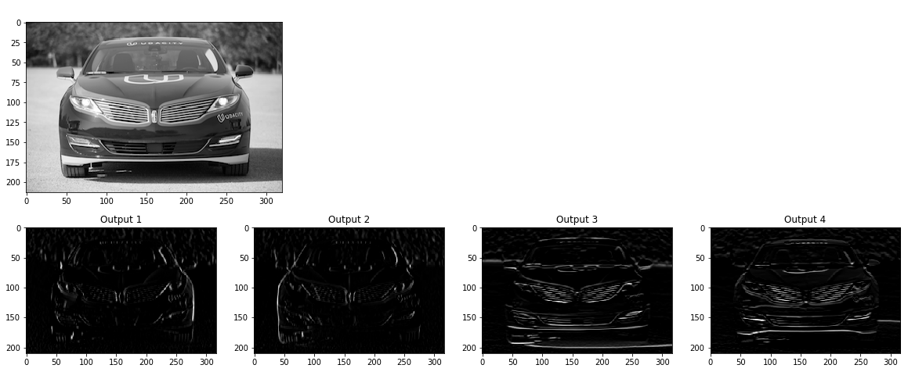
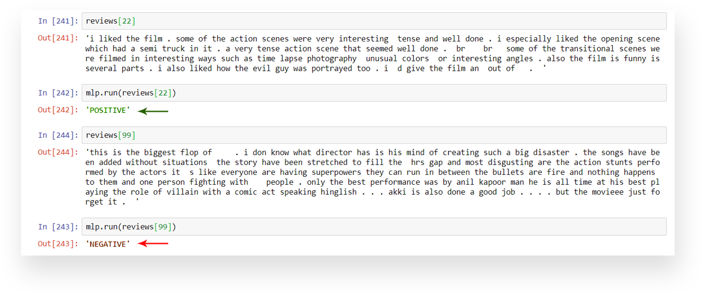
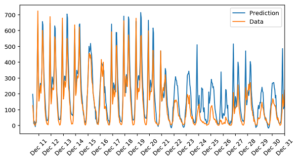
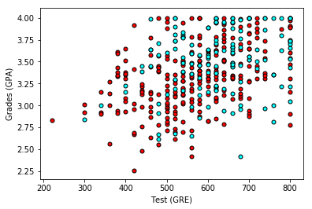
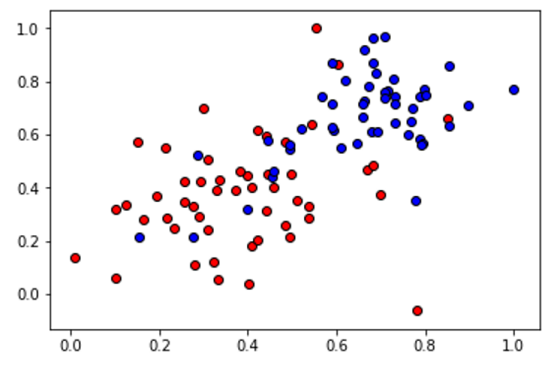

# Deep Learning

I graduated from **Deep Learning Udacity Nanodegree** and I wanted to share my projects that I have done during the study. 
During those projects, I was able to train neural networks to do complicated tasks such as face recognition, handwritten digits recognition, classifying dogs breed, transfer style from image to image,  ..etc.

Here you will see a list of of all my projects done during.

## [Face Generation](face-generation/dlnd_face_generation.ipynb "Face Generation")
The faces in the image below (believe it or not) are completely made up. It is the result of my project where the network was trained using a group of celebrities images. After training, it could generate faces one its own.
Of course the images are low resolution to save time and GPU power.

## [Handwritten Digits Recognition](handwritten-digits-recognition/mnist_mlp_solution_with_validation.ipynb "Handwritten Digits Recognition")

One of the fun projects where I trained a neural network to recognize handwritten digits with high accuracy up to **97%**

## [Classifying Objects](image-classification/cifar10_cnn_exercise.ipynb "Classifying Objects")
Identefying objects in images. The classification list of objects has 1000 items.

## [Classifying flowers](/flower-classification/Transfer_Learning_Solution.ipynb "Classifying flowers")
Identifying the type of flowers using Transfer Learning technique using VGG-16 trained network.

## [Style Transfer](/style-transfer/Style_Transfer_Solution.ipynb "Style Transfer")
One of the most interesting projects. I trained a neural network to transfer a style from an image to another.

## [Detecting Dogs Breed](/dog-breed/dog_app.ipynb "Detecting Dogs Breed")
Training a network to detect the breed of a dog in any image. The network can identify 133 breeds. Additionally, if you pass a human image, the network tries to find the closest dog breed that resemble him/her.

## [Image to Image translation](/image-to-image-translation/CycleGAN_Solution.ipynb)
Very interesting project where the network CycleGAN can translate an image to another image. For instance, a horse to zebra , or summer to winter.

## [TV Script Generation](/tv-script-generation/dlnd_tv_script_generation.ipynb "TV Script Generation")
Another challenging but fun project. Using Recurrent Neural Network, I managed to train a network that read **Seinfeld** TV show script and generated a new script from scratch using a seed word.
The generated script is not perfect, because it takes a lot of efforts and time beyond the scope of the course.
However, the script was good enough to be human friendly.

## [Visualizing Convolutional Networks](convolutional-network-visualization/conv_visualization.ipynb "Visualizing Convolutional Networks")
It is important when training a Convolutional Network to visualize what the newtork see of your data. It helps you see with the computer eyes, for example in the picture, you can see how the network identify the edges of the car in different way for each filter.

## [Deploying and Training Networks with AWS SageMaker](sagemaker-deployment/SageMaker-project.ipynb)
It is time now to put the trained model in production. One of the great tools that help train, deploy and update a model is **AWS SageMaker**.
In this project, I deployed the sentiment analsys project to AWS, created an API gateway, Lambda function and a SageMaker endpoint. In the video below you can see the model in action.
The HTML web page is making a call to the API deployed to get the sentiment of the randomly picked movie review (from IMDB website).

## [Sentiment Classification](sentiment-classification/sentiment-classification-solution.ipynb "Sentiment Classification")

The project is about building a network to predict sentiment (positive or negative) in movie reviews.

## [Bike Rental Ridership Prediction](bike-sharing-rental-ridership/bike-sharing-rental-ridership.ipynb "Bike Rental")

The project is about building a network neural network and use it to predict daily bike rental ridership.
Based on data collected over a passed year.

The trained network could predict the future demand on the bike riding rental with accuracy up to **80%**

## [Analyzing Student Data](student-admissions/student-admissions.ipynb "Student Admissions")

The project is to predict student admissions to graduate school at UCLA based on three pieces of data:

-   GRE Scores (Test)
-   GPA Scores (Grades)
-   Class rank (1-4)

## [Gradient Descent](gradient-descent/gradient-descent.ipynb "Gradient Descent")

In the this project, I was able to implement the gradient descent algorithm on the following sample dataset with two classes.

Implemented functions that build the gradient descent algorithm, namely:

-   sigmoid: The sigmoid activation function.
-   output_formula: The formula for the prediction.
-   error_formula: The formula for the error at a point.
-   update_weights: The function that updates the parameters with one gradient descent step.
